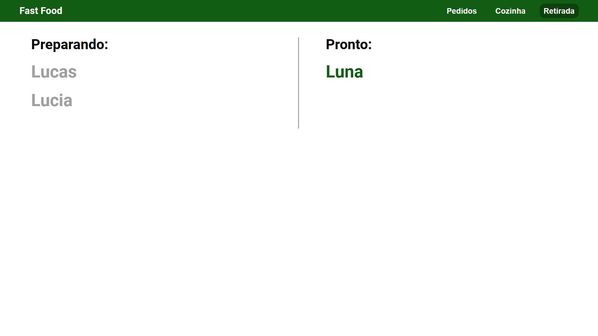

  <h1 align="center">
    Devio Front-end
  </h1>

## O site

Dentro do site é possível ver as comidas disponíveis separadas por categoria, ou então pesquisar pelo nome de uma comida específica. Após selecionar as comidas que deseja comprar, o usuário é redirecionado a uma tela de pagamento, na qual ele deve colocar o seu nome. Ao selecionar a opção de pagamento por dinheiro, a tela vai mostrar o troco do valor entregue.

Também existe uma tela para a cozinha, mostrando os pedidos com a opção de cancelar ou de confirmar como finalizado. Por fim, existe uma tela para os usuários visualizarem o progreço do pedido com base no nome entregue no pagamento.

## Tela inicial

## Tela de pagamento

## Tela da cozinha

## Tela de retirada

